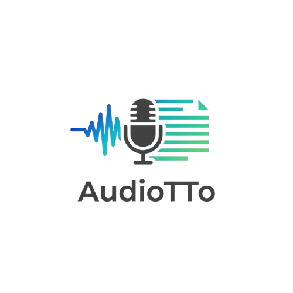
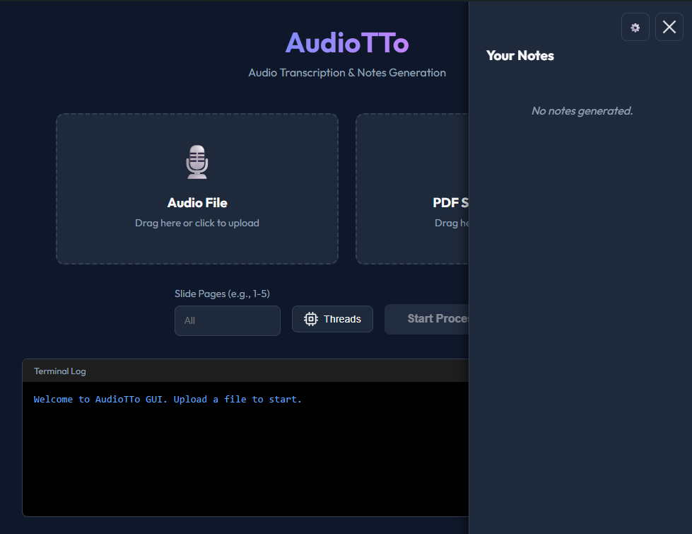

<p align="center">
  
</p>

<h1 align="center">AudioTTo</h1>

<p align="center">
  <b>Audio Transcription, Slide Integration & LaTeX Notes Generation</b>
</p>

<p align="center">
  <a href="https://www.python.org/"></a>
  <a href="https://github.com/guillaumekln/faster-whisper"></a>
  <a href="https://deepmind.google/technologies/gemini/"></a>
  <a href="https://opensource.org/licenses/MIT"></a>
</p>

<p align="center">
  <a href="https://www.paypal.com/paypalme/Emarzone"></a>
</p>

<p align="center">
  <i>Transform your audio recordings into structured, professional LaTeX notes instantly.</i>
</p>

---

## 📖 Overview

**AudioTTo** is a powerful Python application designed to streamline the process of creating study notes. It takes audio recordings (lectures, meetings, etc.) and optionally PDF slides, then uses advanced AI to generate comprehensive LaTeX documents.

### ✨ Key Features

- 🎙️ **Local Transcription**: Uses [`Faster-Whisper`](https://github.com/guillaumekln/faster-whisper) for fast, accurate, and private audio transcription.
- ✂️ **Efficient Processing**: Automatically chunks audio for parallel processing, maximizing CPU usage.
- 🧠 **AI-Powered Notes**: Leverages **Google Gemini AI** to synthesize transcripts into structured LaTeX notes.
- 🖼️ **Visual Integration**: Extracts images from PDF slides and embeds them directly into the notes where relevant.
- 🚀 **Modern UI**: Includes a user-friendly web interface for easy drag-and-drop operation.

---

## 📸 App Screenshots

<p align="center">
  
  &nbsp;
  
</p>

---

## 🛠️ Prerequisites

Before you begin, ensure you have the following:

- **Python 3.12 (recommended)** or higher (only if running from source).
- A **LaTeX Distribution** installed and added to your PATH (required for PDF compilation). You can download it manually or use the included helper scripts:
    - **Windows**: [MiKTeX](https://miktex.org/) (Recommended) or [TeX Live](https://www.tug.org/texlive/)
      - *Alternative*: Run `Install_MiKTeX.bat` included in the folder.
    - **macOS**: [MacTeX](https://www.tug.org/mactex/)
      - *Alternative*: Run `install_deps_mac.sh` included in the folder (requires Homebrew).
    - **Linux**: `texlive-full`
      - *Alternative*: Run `install_deps_linux.sh` included in the folder.
- A **Google Gemini API Key**. You can get one from [Google AI Studio](https://aistudio.google.com/).

---

## 📦 Installation (Executable)

If you downloaded the **standalone executable**:

1.  **Download** the latest version from the [Releases](https://github.com/Manumarzo/AudioTTo/releases) page.
2.  **Prerequisites**: You still need a working **LaTeX distribution** installed (see Prerequisites above).
3.  **Run**:
    - **Windows**: Double-click `AudioTTo.exe`.
    - **macOS**: Double-click `AudioTTo.app`. *Note: If you see a security warning, go to System Settings > Privacy & Security and allow the app.*
    - **Linux**: Open a terminal in the folder and run `./AudioTTo` (ensure it has execution permissions: `chmod +x AudioTTo`).

---

## ⚙️ Installation (Source Code)

1.  **Clone the repository** (or download usage files):
    ```bash
    git clone https://github.com/Manumarzo/AudioTTo.git
    cd AudioTTo
    ```

2.  **Install dependencies**:
    ```bash
    pip install -r requirements.txt
    ```

---

## 🚀 How to Use

AudioTTo provides both a modern Web GUI and a classic CLI.

### 🖥️ Option 1: Web Interface (Recommended)

The easiest way to use AudioTTo.

1.  **Launch the application**:
    ```bash
    python gui_app.py
    ```
2.  **Interact**: A window will open automatically (or go to `http://localhost:8000`).
3.  **Configure**: Click the **Settings (⚙️)** button to enter your Gemini API Key.
4.  **Process**:
    - Drag & drop your **Audio** file.
    - (Optional) Drag & drop your **Slides (PDF)**.
    - Click **Start Processing**.

### 💻 Option 2: Command Line Interface (CLI)

For automation or headless environments.

**Set your API Key first:**
Create a file named `.env` in the root directory of the project. Open it with a text editor and add your API Key:
    ```env
    GEMINI_API_KEY=your_actual_api_key_here
    ```

**Run the script:**
```bash
# Basic transcription
python AudioTTo.py lecture.wav

# With slides
python AudioTTo.py lecture.wav --slides slides.pdf

# With specific slide pages
python AudioTTo.py lecture.wav --slides slides.pdf --pages 1-15
```

---

## 📂 Output Structure

All generated files are organized in the `output/` directory:

```
output/
└── [Audio_Filename]/
    ├── [Audio_Filename]_trascrizione.txt  # Raw text transcript
    ├── [Audio_Filename]_appunti.tex       # Generated LaTeX source
    └── [Audio_Filename]_appunti.pdf       # Final compiled PDF
```

> 🧹 Intermediate files (chunks, noisy audio, logs) are automatically cleaned up.

---

## 🤝 Contributing

Contributions are welcome! Feel free to open issues or submit pull requests to improve AudioTTo.

## 🌟 Star History

<p align="center">
  <a href="https://star-history.com/#Manumarzo/AudioTTo&Date">
   <picture>
     <source media="(prefers-color-scheme: dark)" srcset="https://api.star-history.com/svg?repos=Manumarzo/AudioTTo&type=Date&theme=dark" />
     <source media="(prefers-color-scheme: light)" srcset="https://api.star-history.com/svg?repos=Manumarzo/AudioTTo&type=Date" />
     
   </picture>
  </a>
</p>

## ☕ Support the Project

If you find AudioTTo useful and want to support its development, consider making a small donation! Your support helps keep the project alive and improving.

<p align="center">
  <a href="https://www.paypal.com/paypalme/Emarzone"></a>
</p>

## 📄 License

This project is licensed under the **MIT License**.

---

<p align="center">
  Developed with ❤️ by <b>Manumarzo</b>
</p>